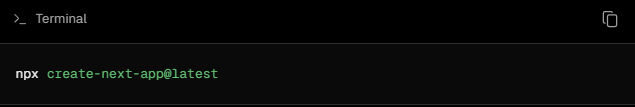
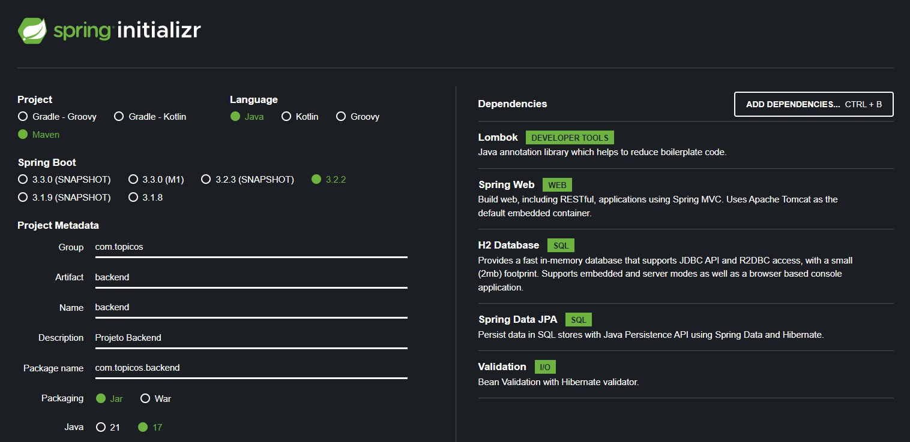

## Projeto de Tópicos Especiais II

### Construir uma aplicação que completa para que sejam cadastrados orçamentos. A aplicação deverá conter o backend com uma API Spring boot e o frontend com NextJS

## DER da aplicação

## Criação do projeto frontend

### Seguindo a documentação da versão 14 do Next.js o projeto frontend foi criado utilizando o comando:

### A criação do projeto backend seguiu com o auxílio do spring initializr, seguindo estas configurações:
