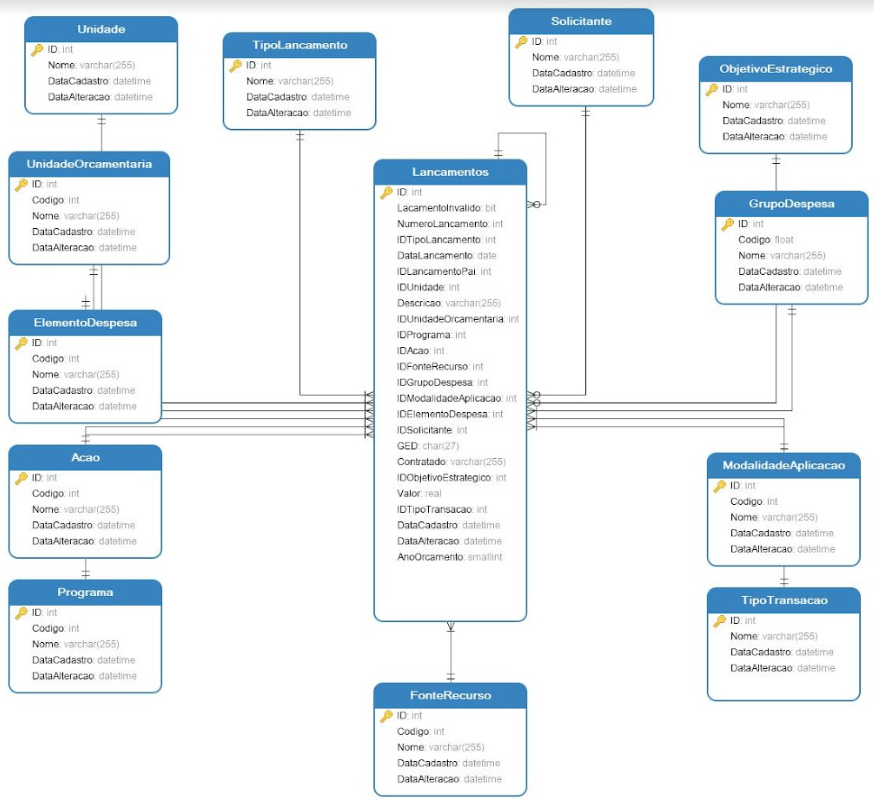

## Projeto de Tópicos Especiais II

### Construir uma aplicação que completa para que sejam cadastrados orçamentos. A aplicação deverá conter o backend com uma API Spring boot e o frontend com NextJS

## DER da aplicação


## Criação do projeto frontend

### Seguindo a documentação da versão 14 do Next.js o projeto frontend foi criado utilizando o comando:
```
npx create-next-app@latest
```


## Criação do projeto backend

### A criação do projeto backend seguiu com o auxílio do spring initializr, seguindo estas configurações:


### Após a criação do projeto foi adicionada a dependência swagger para simplificar os testes da API

```
<dependency>
    <groupId>org.springdoc</groupId>
    <artifactId>springdoc-openapi-starter-webmvc-ui</artifactId>
    <version>2.2.0</version>
</dependency>
```

## Figma

### O design da aplicação foi projetado no Figma, de modo a ficar intuitivo e completo.

* [Figma](https://www.figma.com/file/8iOBS9trrTRJdEUxAsUAaH/Or%C3%A7amento?type=design&node-id=2-88&mode=design)

## Arquitetura inicial do projeto backend
